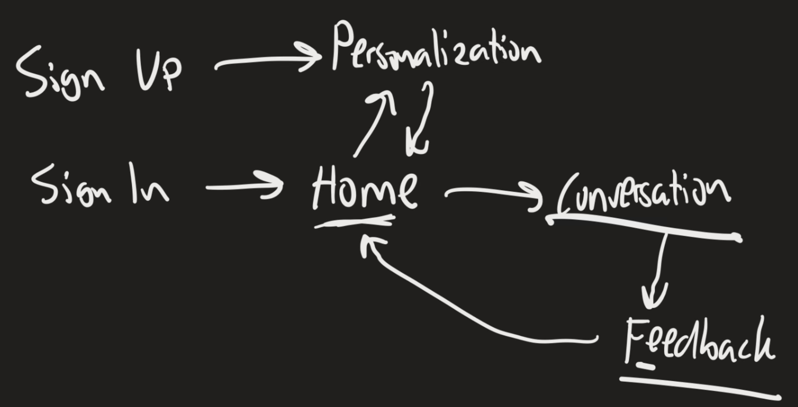

# Lingo

Have a conversation with our AI and get instant feedback on the language you are learning.

## UI Flow

## APIs

POST /chat
headers: { 'Content-Type': 'application/json', 'Authorization': 'Bearer <token here>' }
body:
{
conversation_history: [{ text: string, is_user_message: boolean }],
user_id: string,
}

response:
{
response: string,
}

POST /analyze-proficency
headers: { 'Content-Type': 'application/json', 'Authorization': 'Bearer <token here>' }
body:
{
conversation_history: [{ text: string, is_user_message: boolean }],
user_id: string,
}

response:
{
profiency_level: string,
feedback: string,
}
